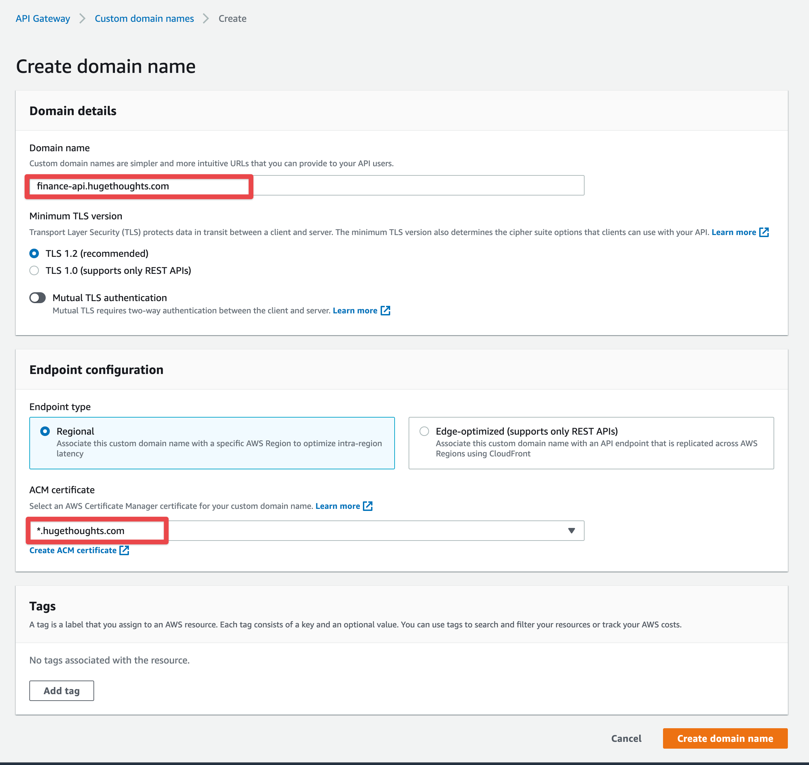
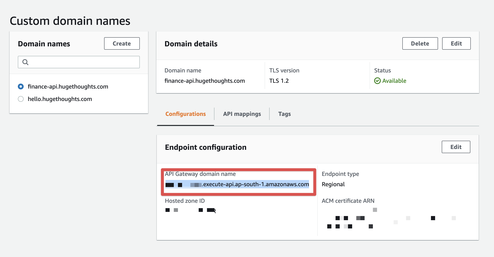
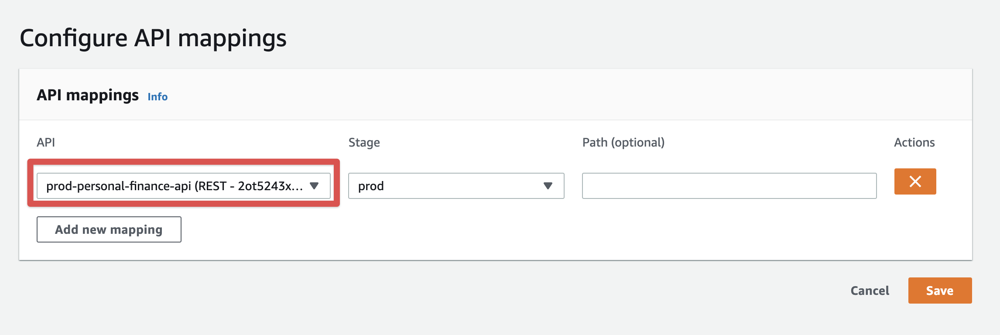

# Setup Domain

Go to [API Gateway](https://ap-south-1.console.aws.amazon.com/apigateway/main/publish/domain-names/create?region=ap-south-1)

Now we need to create a CNAME with that api endpoint so that we can map the domain

